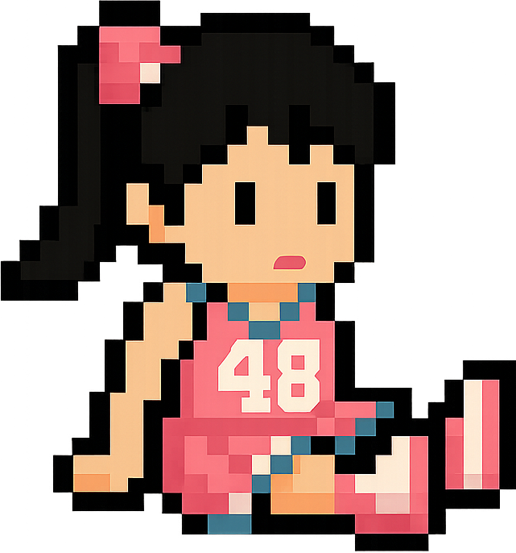
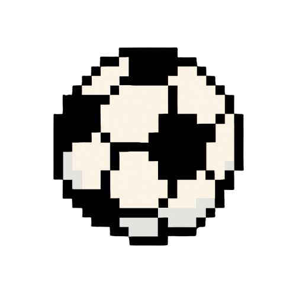
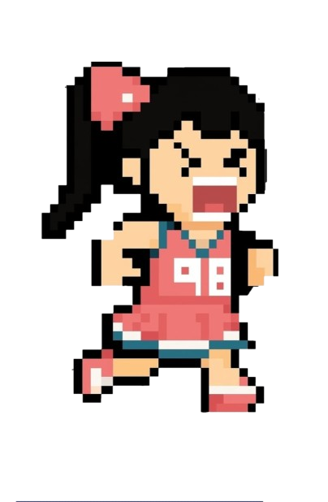

<!DOCTYPE html>
<html lang="id">
  <head>
    <meta charset="UTF-8" />
    <meta name="viewport" content="width=device-width, initial-scale=1" />
    <title>Game Aurhel Alana</title>
    
  </head>
  <body>
    

      <button onclick="startGameFromButton()">🎮 Mulai Main</button>
    

    

      

        
      

      

        
      

      

        

          Game Over! Yah Lana Terjatuh! 
          Final Score: 0
        

        <button onclick="resetGame()">Main Lagi</button>
      
 

      <audio id="bgm" src="" loop></audio>

      
Score: 0

      

        🔊
        <input
          type="range"
          id="volumeSlider"
          min="0"
          max="1"
          step="0.01"
          value="1"
        />
      

      <!-- Tombol Skill Teriak -->
      <button id="shoutSkill" class="skill-button">
        
        
0

      </button>

      
    

  </body>
</html>
